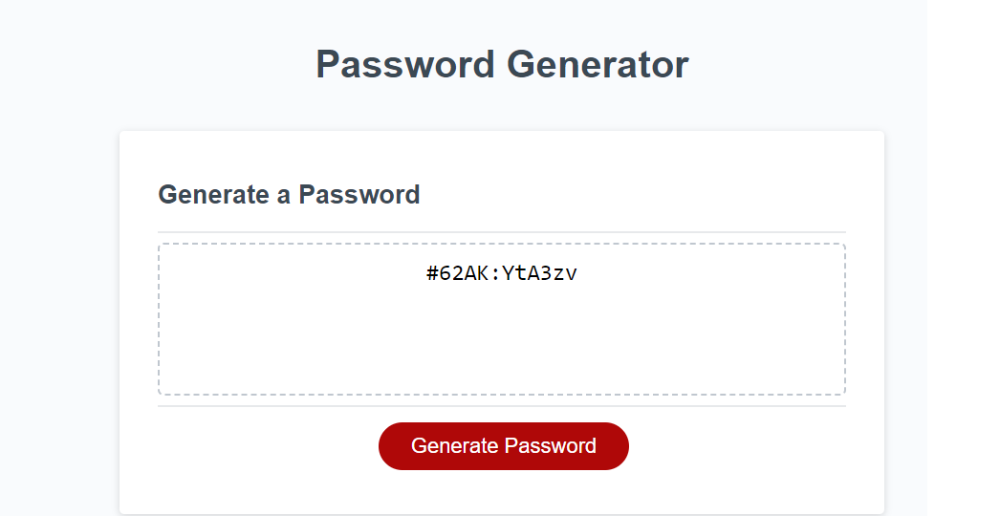

# Password Generator

## Objective
Create a random password generator that will:
- Have variable length determined by user input
- Have a list of possible characters determined by user input
- Shuffle and return a password based on above selections

## Project Rundown

- Created a series of pop-ups that the user interacts with to determine password length and the character sets used
- A loop will select one of each character chosen
- A second loop will then randomly select characters until the proper length has been met
- Shuffle function added to scramble password characters

## Mock Up

